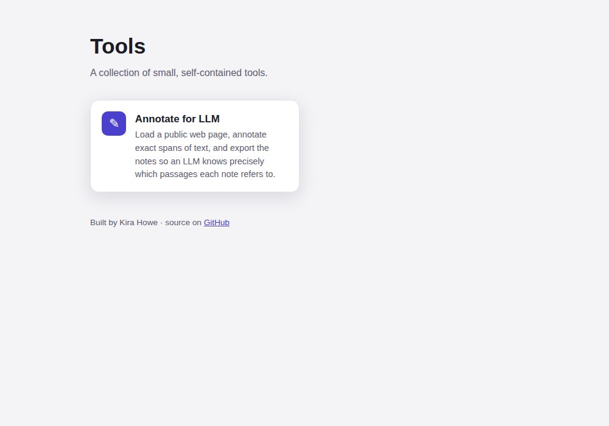

# tools

A monorepo of small, self-contained web tools, deployed together to a single
Cloudflare Pages project and served under one subdomain, each at its own path:

- **`tools.kirahowe.com/annotate`** — [Annotate for LLM](tools/annotate) — annotate
  any public web page and export the notes so an LLM knows exactly which passages
  each note refers to.



## How it's organised

```
tools/<name>/        a web tool: TypeScript in src/, static assets in public/
  src/app.ts         entry point (bundled to /<name>/app.js)
  public/            index.html, styles.css, manifest, sw.js, icons (%BASE% templated)
  tool.json          title/description/emoji for the landing page
functions/<name>/    Cloudflare Pages Functions for that tool -> /<name>/api/…
web/                 the umbrella landing page + shared _headers
build.mjs            builds every tool into dist/<name>/, assembles the landing page
dist/                build output Cloudflare serves (git-ignored)
```

Each tool is **mounted at `/<name>`**. The build injects that base path so a tool
works from a sub-path without a `<base>` tag:

- TypeScript is bundled with `__BASE__` defined to `"/<name>"` (used for the
  `/<name>/api/…` fetch and the service-worker scope).
- Static files have the `%BASE%` token replaced with `/<name>` (asset URLs, the
  web manifest's `start_url`/`scope`, the service worker's cache list).

Cloudflare Pages Functions are routed by file path, so `functions/annotate/api/fetch.ts`
automatically serves `/annotate/api/fetch` — no config per tool.

## Local development

```bash
npm install
npm run watch      # rebuild tools into dist/ on change (one terminal)
npm run preview    # wrangler pages dev dist  (another terminal: serves dist/ + functions/)
```

Or a one-off build: `npm run build` (output in `dist/`).

Type checking: `npm run typecheck` (browser code) and `npm run typecheck:functions`.

## Deploying (Cloudflare Pages)

One Pages project serves the whole repo. Connect the repo in the Cloudflare
dashboard with:

- **Build command:** `npm run build`
- **Build output directory:** `dist`

Functions in `functions/` are picked up automatically; every push deploys. Or
deploy from your machine with `npm run deploy`.

Point the custom domain `tools.kirahowe.com` at the project (Pages → Custom
domains). If the DNS zone is on Cloudflare it's one click; otherwise add a
`CNAME tools → <project>.pages.dev`.

## Adding a new web tool

1. `mkdir -p tools/<name>/src tools/<name>/public` and add an `app.ts`, an
   `index.html`, and a `tool.json`. Copy `tools/annotate` as a template — it's
   already base-path aware.
2. Reference assets with `%BASE%/…` in HTML/manifest, and use `${__BASE__}` for
   any same-origin API calls in TypeScript.
3. Put any serverless endpoints in `functions/<name>/…`.
4. `npm run build` — it appears in `dist/<name>/` and on the landing page
   automatically.

## Philosophy

This repo is the **sandbox** where small tools start life cheaply. The rule for
what lives here vs. its own repo is the *release lifecycle*: things that deploy
together and share no independent versioning stay here; a tool that needs its own
versioned releases (e.g. a CLI shipping binaries via GitHub Actions), its own
issue tracker, or a heavier backend **graduates** to a dedicated repo (and, if it
has a UI, its own subdomain). Dead experiments just get deleted — git history
keeps them.

## License

MIT © Kira Howe
