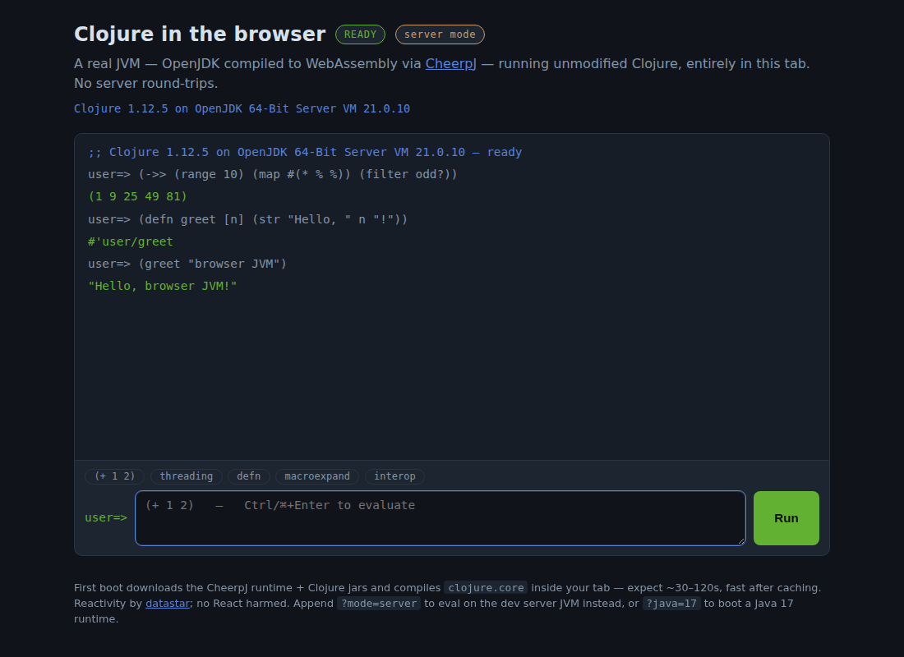

# clojure-wasm — a real JVM Clojure REPL in the browser

Unmodified Clojure 1.12.5, running on an unmodified OpenJDK — inside a
browser tab, via [CheerpJ](https://cheerpj.com)'s WebAssembly JVM. Type
`(defn …)` and real bytecode gets compiled and loaded by the real Clojure
compiler, with zero server round-trips.

This is step one toward running [Clay](https://scicloj.github.io/clay/)
notebooks on users' hardware; see [RESEARCH.md](./RESEARCH.md) for the
state-of-the-art survey (CheerpJ vs GraalVM Web Image vs TeaVM vs …) and
the roadmap toward that goal.



## Quickstart

Requires [babashka](https://babashka.org), the
[Clojure CLI](https://clojure.org/guides/install_clojure), and a JVM.

```sh
bb jars   # download the Clojure jars the browser JVM will load (~5 MB, once)
bb dev    # serve http://localhost:8080
```

Open <http://localhost:8080>. First boot streams the CheerpJ runtime from
their CDN and JIT-compiles `clojure.core` in your tab — expect ~30–120s;
it's much faster once cached. Then it's a normal REPL: `Ctrl/⌘+Enter`
evaluates, `↑` recalls history, `(in-ns …)` and `defn` persist between
submissions, output is captured, infinite seqs print truncated.

Query params:

| param | effect |
|---|---|
| `?java=17` | boot a Java 17 runtime instead of the default Java 8 |
| `?mode=server` | evaluate on the dev server's JVM instead of the in-tab JVM (UI development / e2e without the CDN) |

## How it works

```
browser tab
├── datastar (vendored v1.0.2) — all UI reactivity via signals; no React
├── repl.js — boots the runtime, ferries strings across the JS/JVM boundary
│     cheerpjInit() → cheerpjRunLibrary("/app/jars/clojure-1.12.5.jar:…")
│     → Clojure.var("clojure.core", "load-string") → loads bootstrap.clj
└── CheerpJ JVM (WASM) running bootstrap.clj:
      browser.repl/eval-str : code string → {"tag","val","out","ns"} JSON
```

- **`resources/public/bootstrap.clj`** is the whole REPL engine — read/eval
  loop, namespace persistence, output capture, error tagging, JSON
  encoding. It runs identically on any JVM, which is what makes the app
  testable without a browser.
- **`src/clojure_wasm/server.clj`** is a zero-dependency dev server (JDK
  built-in `HttpServer`; the project's only dependency is Clojure itself).
  It serves the static app plus `POST /api/eval`, which runs the *same*
  `bootstrap.clj` on the server JVM — that's what `?mode=server` and the
  e2e suite use.
- **datastar** drives every dynamic bit of UI (status pill, boot phase,
  prompt namespace, busy state) from signals; `repl.js` pushes updates by
  dispatching `CustomEvent`s handled by `data-on:*` attributes on `<body>`.
- Jar versions live in one place: `resources/public/jars/manifest.json`
  (`bb jars` downloads them; `repl.js` builds the CheerpJ classpath from it).

## Development

```sh
bb test   # unit tests: REPL engine contract + server routing (18 tests)
bb lint   # clj-kondo
bb e2e    # Playwright: boots the app headless, drives the full REPL flow
          # (server mode; E2E_MODE=wasm runs the same suite against the
          #  real browser JVM — needs CDN access and patience)
```

## Security note

`POST /api/eval` is arbitrary code execution **by design** — it exists so
the UI and tests can run where the CheerpJ CDN can't. The server binds to
`127.0.0.1` by default. Don't expose it; set `NO_SERVER_EVAL=1` to disable
the endpoint entirely. (The wasm mode needs no server at all beyond static
files.)

## Known limitations

- CheerpJ streams from `https://cjrtnc.leaningtech.com` (their license
  doesn't allow self-hosting the runtime on the free tier), so the wasm
  mode needs that host reachable. Commercial/hosted use of CheerpJ
  requires a license from Leaning Tech.
- Evaluation runs on the tab's main thread; a long-running form will make
  the tab feel busy. Moving the JVM into a Web Worker is the natural next
  step.
- Java 8 runtime by default (most mature in CheerpJ); 11 and 17 available,
  Java 21 expected with CheerpJ 6.0.
