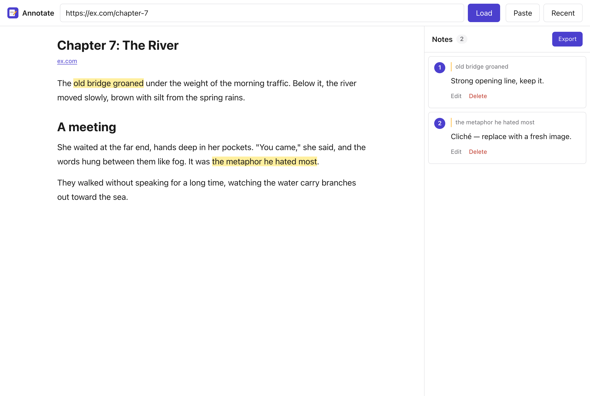

# Annotate

Load any public web page (or paste your own text), highlight the exact passages
you want to comment on, and export your notes — with each note tied to the
**precise span of text** it refers to.

The exports keep each note anchored to its quote, so they're easy to share or
review later. One format embeds the notes inline in the full document, which is
handy when you want to hand the whole thing to an assistant to revise in place.

Part of the [`tools`](../../) monorepo; deployed at `tools.kirahowe.com/annotate`.



## Why there's a (serverless) proxy

Everything that matters — extracting readable text, anchoring notes to exact
character offsets, highlighting, exporting, and saving your notes — runs entirely
in your browser. The *one* thing a browser can't do is fetch an arbitrary other
website: cross-origin requests are blocked by CORS, enforced by the browser itself
(WebAssembly, service workers, etc. can't get around it).

So one small endpoint on the site's Cloudflare Worker (`worker/index.ts` at the
repo root, served at `/annotate/api/fetch`) fetches the page for you on
Cloudflare's edge and hands back the HTML. It runs on demand and scales to zero.
If you'd rather not use it, the **Paste** button lets you drop in text or HTML
directly, fully offline.

## Using it

1. Paste a public page URL and press **Load** (or use **Paste** for raw text/HTML).
2. Select any text — an **Add note** button appears — and write your comment.
3. Notes are listed on the right (a drawer on mobile) and saved in this browser's
   local storage — on this device only, not backed up or synced, so export
   anything you want to keep.
4. Press **Export** to copy or download your notes in the format you want.

Tip: `…/annotate/?url=https://…` loads a page immediately (handy as a bookmarklet).

## Export formats

- **Inline document** — the full text reproduced verbatim, with each annotated
  span wrapped in `⟦ ⟧` and marked with a footnote reference (`[^1]`) whose note
  is listed at the end. Best for asking an LLM to revise the document in place.
- **Notes list** — a readable list; each note carries its exact quote, the
  surrounding context, and a location (nearest heading + block + char range).
- **JSON** — structured output (W3C Web Annotation–style `TextQuoteSelector` +
  `TextPositionSelector`) including the full document text and character offsets.

## How anchoring stays precise

Each annotation records the exact quoted text plus a prefix/suffix of surrounding
context and character offsets into a single canonical plain-text version of the
document. On reload the note is re-located by searching for that quote (scored by
context and position), so annotations survive re-fetches and minor edits; if the
quote can't be found the note is shown as *orphaned* rather than silently pointing
at the wrong place.

Highlights are painted with the [CSS Custom Highlight API](https://developer.mozilla.org/docs/Web/API/CSS_Custom_Highlight_API),
which draws over the text **without inserting elements** — keeping the DOM (and
therefore the offsets) exactly as measured.

## Files

```
src/
  app.ts          UI wiring: load, select→note, sidebar, export, persistence
  textmap.ts      canonical text + exact DOM-range ↔ offset mapping
  anchor.ts       re-locate stored annotations in the current text
  highlight.ts    CSS Custom Highlight API rendering
  extract.ts      Readability extraction + DOMPurify sanitizing
  exporters.ts    the three export formats
  storage.ts      localStorage persistence
  types.ts        shared types
public/           index.html, styles.css, manifest, service worker, icons
```

## Security notes

- Fetched HTML is sanitized with **DOMPurify** before it's ever rendered.
- The proxy only allows `http`/`https`, caps responses at 8 MB, times out, and
  blocks private/loopback/link-local addresses (basic SSRF protection).
- A strict `Content-Security-Policy` (see `web/_headers`) is applied site-wide.
