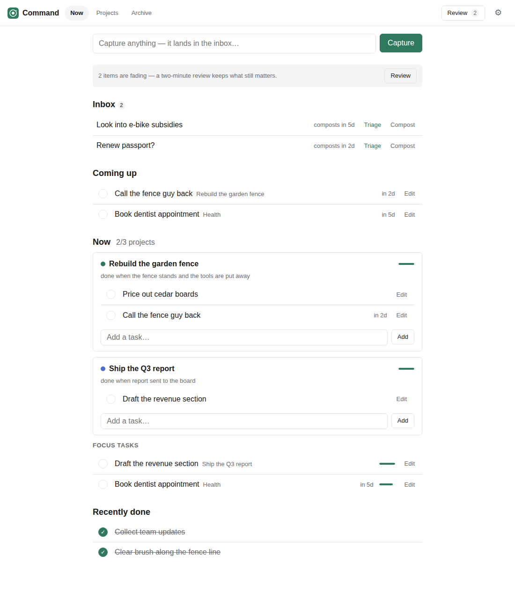

# Command

A life command centre built around one inversion: **things expire unless you
affirmatively keep them alive**. Ordinary todo tools accumulate a guilt pile of
stale items until you abandon them; here, anything you stop touching visibly
fades and eventually **composts** itself into a revivable archive. The list you
see is, by construction, the list of things you recently cared about.

Part of the [`tools`](../../) monorepo; deployed at `tools.kirahowe.com/command`.
The full design rationale lives in
[docs/command-centre-design.md](../../docs/command-centre-design.md).



## The mechanics

- **Decay.** Every area, project, and task carries a `touchedAt` clock.
  Untouched items age through fresh → aging → stale, then compost. Clocks per
  level: inbox 7 days, tasks 30, projects 180, areas ~400 (all adjustable in
  settings). Attention propagates upward — completing a task renews its
  project; a live project keeps its area alive — so a year-long slow burn
  survives just by being occasionally brushed against.
- **The Now slate.** At most a few projects (default 3) and pinned focus tasks
  (default 7) on the main screen. Pulling something on when the slate is full
  forces you to pick what gets bumped — the cap, not a score, is the
  prioritization.
- **Horizons.** Projects sit on now / next / later / someday. Moving between
  them is one select.
- **The inbox.** Quick capture lands here, on the fastest clock in the system.
  Triage it into a real task or let it compost — the inbox cannot accumulate.
- **Review.** One item at a time, nearest compost first: *still matters* /
  *not now* (demote) / *let it go* (compost). Two minutes, no obligation —
  skipping reviews just means things compost on their own, which is fine.
- **Away detection.** After a few quiet days (no human activity), the next
  visit opens with a one-tap "Bump everything N days" offer, and **nothing
  composts while that question is open**. Vacations are not abandonment; the
  tool never nags and never assumes bad intent.
- **Done log.** Completed tasks show on the dashboard for two weeks — a
  rear-view mirror to balance a tool whose whole aesthetic is letting go.

Dated tasks are the one exception to decay: a task with a future due date
surfaces on the dashboard and won't auto-compost while the date is ahead.

## Data & sync

State lives on this device (localStorage), with JSON export/import in settings
as both backup and escape hatch. Every change flows through a mutation log
(`store.ts`), which is the seam where milestone 2 adds sync: Worker API routes
backed by D1, the same log pushed as a queue, `?since=` pulls, last-write-wins.
The design doc has the details, including the agent-facing API sketch.

## Files

```
src/
  app.ts       UI wiring: dashboard, projects, review, archive, editors, away flow
  decay.ts     freshness staging, attention propagation, review queue, ripeness
  store.ts     mutation-log storage over localStorage; export/import
  types.ts     data model, mutation ops, default settings
  ulid.ts      sortable client-generated ids (offline-safe, idempotent writes)
public/        index.html, styles.css, manifest, service worker, icons
```

No Worker routes yet — the tool is fully static and works offline once the
service worker has cached the shell.
