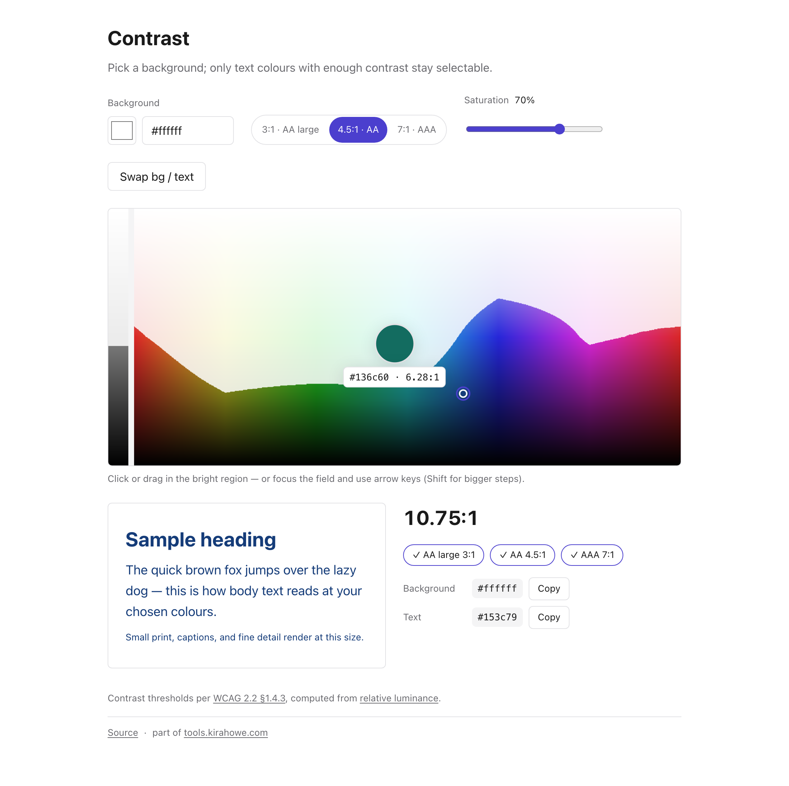

# Contrast

Pick a background colour, then choose text colours from only the ones with
enough WCAG contrast to stay legible.

Choose a background, and a continuous colour field is rendered live: a
greyscale strip plus a hue-by-lightness plane, with saturation set by a
slider. Every point is scored against the background with the WCAG contrast
ratio; anything under the selected threshold (3:1 for AA large text, 4.5:1
for AA, 7:1 for AAA) is dimmed toward the page background rather than
hidden, so the bright region traces the exact shape of the passing colours.
Click or drag anywhere in the bright region to pick that exact colour, or
tune saturation and swap background/text as you go. The field can also be
focused and driven with arrow keys, which can move the marker freely through
dimmed territory — useful since the passing region can split into
disconnected bands — and the selected text colour only updates once the
marker lands back on a passing point. State round-trips through the URL
hash, so a chosen pair can be bookmarked or shared as a link.

Uses the WCAG 2.x relative-luminance formula for contrast.

Part of the [`tools`](../../) monorepo; deployed at `tools.kirahowe.com/contrast`.

