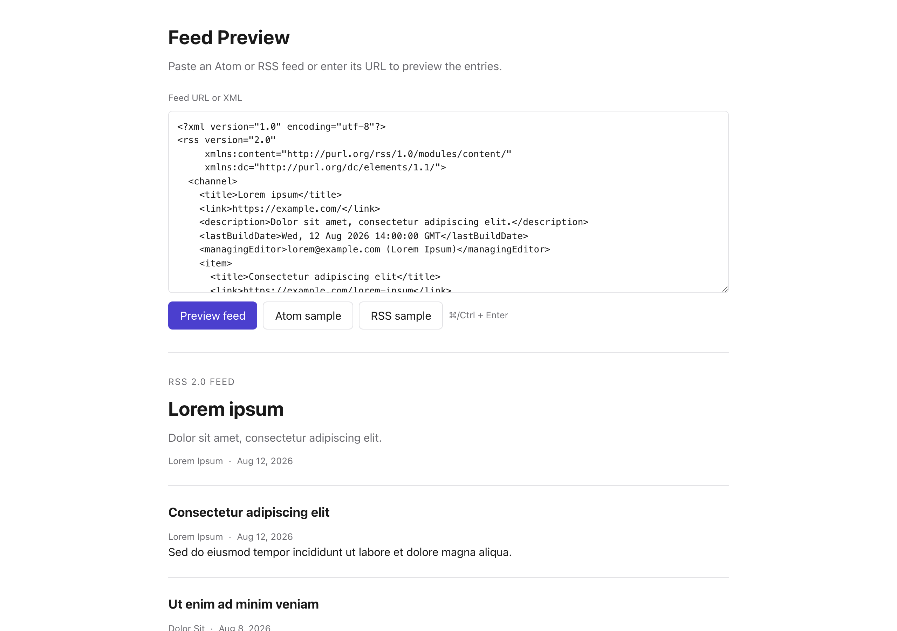

# Feed Preview

Paste feed XML or enter a feed URL to preview its entries. Atom and RSS 2.0
are supported. The **Atom sample** and **RSS sample** buttons load the same two
entries in either format.

Paste XML directly and the whole thing renders in your browser with no network
request at all. Give it a URL instead and it's fetched for you (see below).
The two are told apart by trying to parse the input with `URL()` and accepting
only `http:`/`https:`; a bare `example.com/feed.xml` is retried over `https`
first, since that's what people actually type. The test is conservative because
rejected input is treated as literal feed XML. Whitespace or an angle bracket
settles it. A `?url=` parameter previews a feed
on load, which is enough for a one-line bookmarklet, the same trick
[Annotate](../annotate) documents. And since Enter inside a textarea inserts a
newline, ⌘/Ctrl + Enter is the keyboard route to **Preview feed**.

Rendering uses `DOMParser` in `application/xml` mode, then walks the parsed
document by `localName` rather than assuming a namespace prefix. The root
element picks the parser: `<feed>` is Atom, `<rss>` is RSS (the `version`
attribute goes unread, so the near-identical 0.9x feeds parse too). Both
normalize to the same `Feed`/`Entry` model, so the renderer never learns which
format it got. The difference survives only in a `format` field,
which the page shows above the feed title so you can see what was detected.
That parsing half lives in `src/feed.ts` and knows nothing about the page;
`src/app.ts` renders the model. Errors are reported rather than failing
quietly. A parse failure surfaces the parser's own message, a root element
that's neither `<feed>` nor `<rss>` says so, and an RSS 1.0 (RDF) document is
identified separately.

## Atom

Bodies and titles follow RFC 4287 more closely than they might appear to. An
entry's body comes from its `<content>`, but only when there is something
there to show: a `<content src="…">` is out-of-line and required to be empty,
and a non-text media type is base64. The spec requires a `
` in both
of those cases, so that summary is what gets rendered, rather than an empty
body or a screenful of base64. The `type` attribute may be a bare token or a
media type, so `text/html` is honoured alongside `html` and
`application/xhtml+xml` alongside `xhtml` (feeds write both). Titles,
subtitles and names are Text constructs carrying the same attribute, and
because they're rendered as plain text, an `html`-typed one is flattened so
its markup is resolved instead of printed as literal tags.

## RSS 2.0

RSS has no `type` attribute and no Text or Content constructs, so the same
questions get answered by convention instead of by spec:

- **Bodies.** `<content:encoded>` is preferred over `<description>` when a
  feed carries both, since that's the full post rather than the teaser, and
  it's matched by namespace URI rather than by the `content:` prefix a feed
  happens to bind. Either one is HTML whether escaped or wrapped in CDATA.
  The XML parser resolves both to the same text, which is sanitized like any
  other body. A body with no markup in it at all is
  treated as text so it renders as a paragraph, the way an Atom text body
  does, instead of as a bare run of text with no spacing around it.
- **Links.** RSS writes a link as the element's own text where Atom uses an
  `href` attribute, so both are read. That also covers the common hybrid
  where a channel adds an `<atom:link rel="self">` beside its plain `<link>`:
  a `rel` other than `alternate` points at something that isn't the human
  page, so it's only used if nothing better exists. An item with no `<link>`
  at all falls back to its `<guid>`, but only when that guid is really a
  permalink. `isPermaLink` defaults to true when absent, so a guid that
  isn't an `http(s)` URL is rejected on its own merits rather than on the
  attribute's word.
- **Authors.** `<dc:creator>` wins, because it holds a plain name and it's
  what publishing tools actually write. RSS's own `<author>` and
  `<managingEditor>` hold an email address by the spec's grammar, optionally
  followed by a name in parentheses, as in `ed@example.com (Ed Example)`. The
  name is lifted out when it's there. A bare address is still shown rather
  than dropped, since for some feeds it's the only attribution there is. As
  in Atom, an item with no author of its own inherits the channel's.
- **Dates.** `<pubDate>` for items, `<lastBuildDate>` (then `<pubDate>`) for
  the channel. RSS dates are RFC 822 where Atom's are ISO 8601, but both are
  kept raw in the model and formatted for display by `Intl.DateTimeFormat`,
  which reads either.
- **Channel prose.** `<description>` becomes the subtitle. Plenty of feeds put
  markup in it and it's rendered as plain text, so it's flattened the way an
  `html`-typed Atom subtitle is. Titles are deliberately left alone: RSS
  titles are plain text by convention, and flattening one would eat a literal
  `
` that a post about markup quite reasonably put in its title.

Every lookup is over direct children only, which is what keeps a channel's
`<image><title>` and `<image><link>` from being mistaken for the channel's
own. Podcast and media extensions, including `<enclosure>`, are read by
neither parser; this previews how a feed reads, not what it attaches.

A small visually hidden live region gives screen readers a one-line summary,
such as "Loaded 12 entries from the RSS 2.0 feed Lorem ipsum." The
preview itself deliberately carries no `aria-live`, or every render would read
the entire feed aloud.

## Sanitizing

An entry's body is untrusted third-party HTML. A mistake in sanitizing here is
an actual vulnerability, so
`sanitizeHtml` leans on [DOMPurify](https://github.com/cure53/DOMPurify)
rather than a bespoke walk, the same audited sanitizer
[Annotate](../annotate) uses for fetched HTML. It runs with a tight allowlist
covering headings, paragraphs, line breaks, lists, blockquotes, code, basic
inline emphasis, links, images, and figures, and only `href`, `src`, and
`alt` are allowed through as attributes, so a stray `onerror` never makes it
into the page. An element that isn't on the list is unwrapped in place rather
than dropped, preserving its text. This is DOMPurify's `KEEP_CONTENT` default.
The exception is its bad-list
(`<script>`, `<iframe>`, `<noscript>` and friends), whose contents are
discarded outright.

A second pass then walks the sanitized fragment and resolves every `href` and
`src` through `safeUrl`, which keeps only `http:`, `https:`, and `mailto:` and
removes the attribute entirely if the value doesn't resolve to something safe.
What it resolves *against* depends on where the feed came from. A fetched feed
uses its own final URL rather than this page. A pasted feed has no base URL, so
its relative links are dropped rather than aimed at this
tool's own origin, where they would point somewhere real and entirely wrong.
Images also pick up `loading="lazy"`, and every surviving link opens in a new
tab with `rel="noopener noreferrer"`, so a stray click can't cost you the XML
you just pasted in.

## Why there's a Worker endpoint

Browser CORS rules block requests to arbitrary origins. Pasting a URL sends it
to `/feeds/api/fetch` (the
`fetchFeed` function in `worker/index.ts` at the repo root), which fetches the
feed on Cloudflare's edge and hands the raw XML back. It follows redirects,
allows only `http`/`https` targets, blocks private/loopback/link-local hosts
(basic SSRF protection), and caps the response at 8 MB with a 20-second
timeout. It deliberately does *not* check the response's content type: feeds
are served under a zoo of them, and the XML parser on the other end gives a
better answer than a guess from a header would. The response also carries
`finalUrl`, the final destination after redirects, so relative
links in the feed resolve against that, not against this page. Pasting XML
directly skips all of this; there's no network request to make.

Part of the [`tools`](../../) monorepo; deployed at `tools.kirahowe.com/feeds`.

